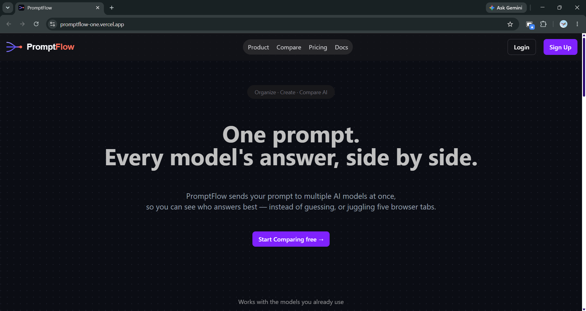
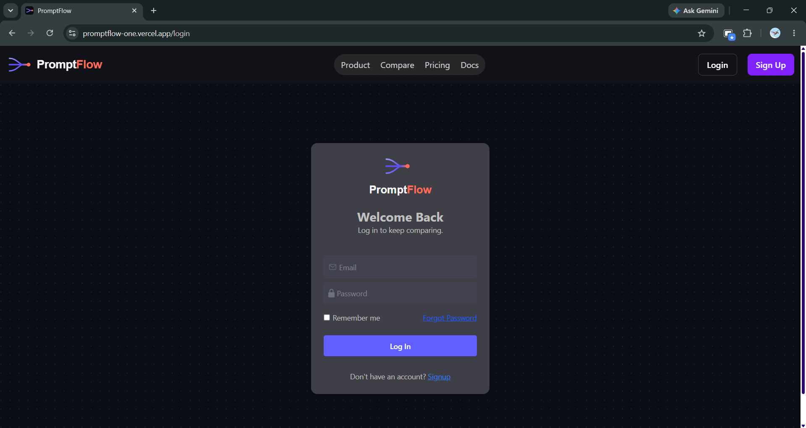
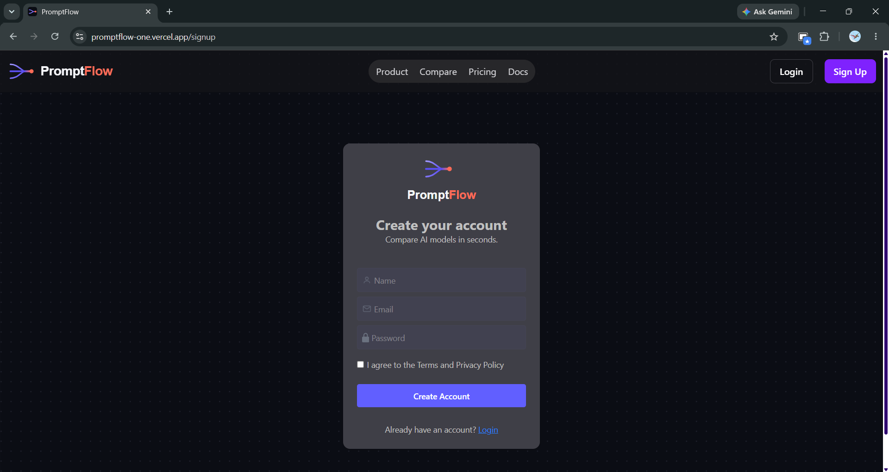
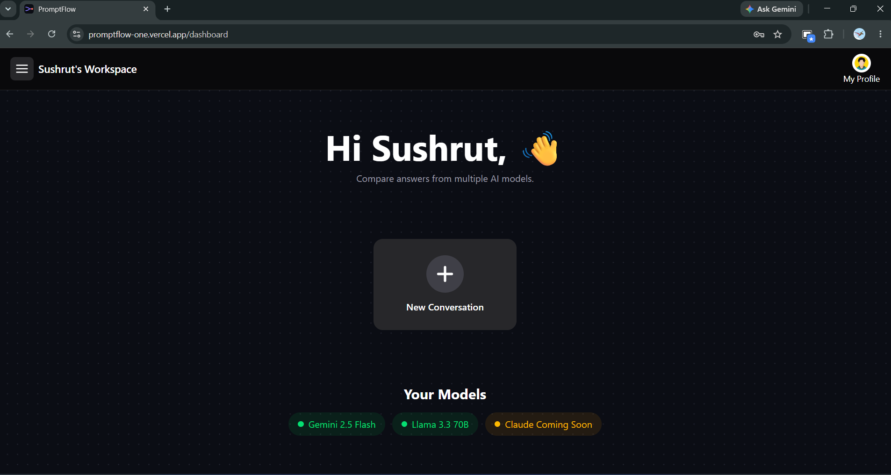
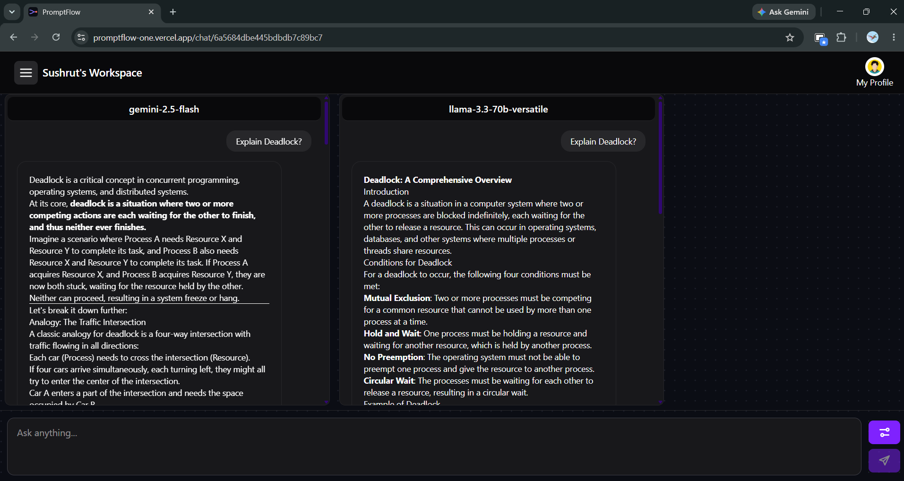
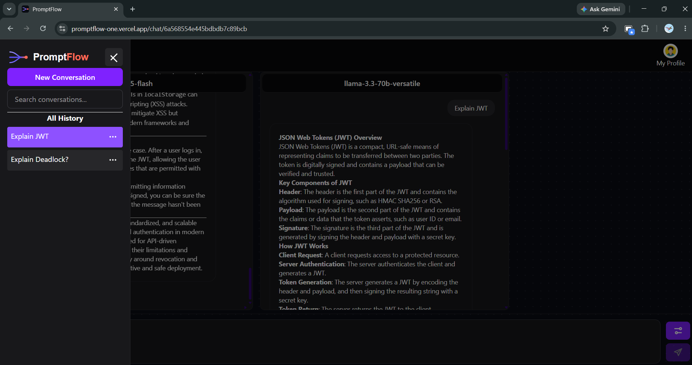
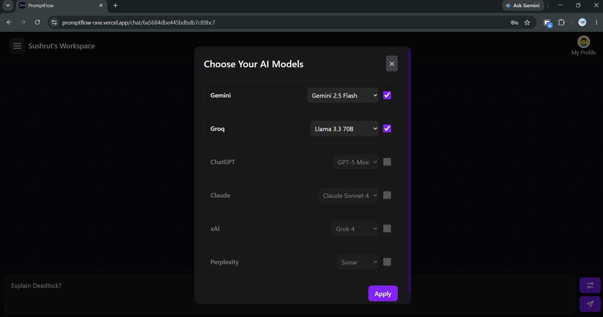

<div align="center">

# PromptFlow

### Organize. Create. Compare. Collaborate with AI.

PromptFlow is a production-grade AI workspace that lets you compare responses from multiple AI models inside a single conversation — no more switching between tabs to test the same prompt across providers.

[](LICENSE)
[](https://react.dev)
[](https://nodejs.org)
[](https://expressjs.com)
[](https://www.mongodb.com)
[](https://redux-toolkit.js.org)
[](https://tailwindcss.com)
[](https://vitejs.dev)

[Live Demo](https://promptflow-one.vercel.app) · [API Base URL](https://promptflow-backend-ynem.onrender.com/api/v1) · [Documentation](#documentation) · [Report a Bug](#support)



</div>

---

## Live Demo

| Environment  | URL                                                                                          |
| ------------ | -------------------------------------------------------------------------------------------- |
| Frontend     | [https://promptflow-one.vercel.app](https://promptflow-one.vercel.app)                       |
| Backend      | [https://promptflow-backend-ynem.onrender.com](https://promptflow-backend-ynem.onrender.com) |
| API Base URL | `https://promptflow-backend-ynem.onrender.com/api/v1`                                        |

> **Note**
> The backend is deployed on Render's free tier. The first request after a period of inactivity may take a few seconds to respond while the server spins up.

---

## Table of Contents

- [About](#about)
- [Features](#features)
- [Tech Stack](#tech-stack)
- [Project Structure](#project-structure)
- [Architecture](#architecture)
- [Screenshots](#screenshots)
- [Installation](#installation)
- [Environment Variables](#environment-variables)
- [Documentation](#documentation)
- [Folder Structure](#folder-structure)
- [Roadmap](#roadmap)
- [Contributing](#contributing)
- [License](#license)
- [Author](#author)
- [Support](#support)

---

## About

Comparing outputs from different AI models is usually a manual, repetitive chore — open Gemini in one tab, ChatGPT in another, Groq in a third, paste the same prompt into each, and eyeball the differences.

**PromptFlow** solves this by giving you a single workspace where you can:

- Send one prompt to multiple AI providers at once
- View responses side-by-side in the same conversation
- Save and revisit full conversation history
- Manage everything behind a secure, authenticated account

This project is built as a **portfolio-quality, production-grade full stack application** using the MERN stack, with a strong focus on clean architecture, modular code organization, and real-world engineering practices — not a tutorial project.

**Current Status:** 🚧 Active Development

---

## Features

### Authentication

- User Registration
- Secure Login
- JWT Authentication
- Refresh Token Authentication
- Persistent Login (session survives page reloads)
- Logout
- Protected Routes
- User Profile Management

### Conversation

- Create Conversation
- Rename Conversation
- Delete Conversation
- Conversation History
- Multi-AI Responses within a single conversation thread

### AI

- Compare Multiple AI Models in one prompt submission
- Gemini Integration
- OpenAI Integration
- Groq Integration
- Model Selection per conversation

### Frontend

- Fully Responsive UI
- Modern Landing Page
- Interactive Dashboard
- Reusable Component Library
- Centralized Redux State Management

### Backend

- Clean REST API
- Modular Folder Structure (feature-based)
- Centralized Error Handling
- Authentication Middleware
- Cloudinary File Upload
- MongoDB Database with Mongoose ODM

---

## Tech Stack

<table>
<tr>
<td valign="top" width="33%">

**Frontend**

- React
- Vite
- Redux Toolkit
- React Router
- Tailwind CSS
- Axios

</td>
<td valign="top" width="33%">

**Backend**

- Node.js
- Express.js
- MongoDB
- Mongoose
- JWT
- bcrypt
- Multer

</td>
<td valign="top" width="33%">

**Cloud & AI**

- MongoDB Atlas
- Cloudinary
- Gemini
- OpenAI
- Groq

</td>
</tr>
</table>

**Deployment:** Vercel (Frontend) · Render (Backend)

---

## Project Structure

At a high level, the repository is organized into three top-level areas:

```
PromptFlow/
├── backend/     # Express REST API, MongoDB models, AI
├── frontend/    # React + Vite client application
├── docs/        # Project documentation and screenshots
├── README.md
└── LICENSE
```

Detailed folder-level breakdowns are available in the [Folder Structure](#folder-structure) section below.

---

## Architecture

PromptFlow follows a straightforward, layered request flow on the backend, and a feature-based module structure on the frontend.

```
React (UI)
    ↓
Axios (HTTP Client)
    ↓
Express (API Layer)
    ↓
Middleware (Auth, Error Handling, Upload)
    ↓
Controllers
    ↓
MongoDB Models (Mongoose)
    ↓
MongoDB (Database)
```

**Key architectural notes:**

- Controllers interact directly with MongoDB models via Mongoose — there is no repository or database service abstraction layer between them.
- The **only** place a dedicated service layer is used is for AI provider integrations (`gemini.service.js`, `openai.service.js`, `groq.service.js`), since each provider requires its own request/response handling logic before being normalized into a common response shape.
- Middleware handles cross-cutting concerns: authentication (`auth.middleware.js`), centralized error handling (`errorHandler.middleware.js`), async error wrapping (`asyncHandler.middleware.js`), and file uploads (`multer.middleware.js`).

For a deeper dive, see [`docs/architecture.md`](docs/architecture.md).

---

## Screenshots

### Landing Page

The public-facing landing page introducing PromptFlow's core value proposition.


### Login

Secure login screen with JWT-based authentication.



### Signup

New user registration flow.



### Dashboard

The main workspace where users manage conversations and interact with AI models.



### Conversation

A live conversation view showing multi-model AI responses side-by-side.



### History

Conversation history view for revisiting past sessions.



### Model Selection

Interface for selecting which AI providers to query for a given prompt.



---

## Installation

### Prerequisites

- Node.js (v18 or higher recommended)
- npm
- A MongoDB Atlas connection string
- API keys for Gemini, OpenAI, and Groq
- A Cloudinary account

### Clone the Repository

```bash
git clone https://github.com/Sushrutg-1/PromptFlow.git
cd PromptFlow
```

### Backend Setup

```bash
cd backend
npm install
npm run dev
```

### Frontend Setup

```bash
cd frontend
npm install
npm run dev
```

Once both servers are running, the frontend will be available at your local Vite dev server URL (typically `http://localhost:5173`), and it will communicate with the backend API.

---

## Environment Variables

Both the `backend/` and `frontend/` directories each contain their own `.env.example` file listing the required environment variables for that part of the application.

> **Warning**
> Never commit real secrets to version control. Copy the provided `.env.example` file to `.env` in each directory and fill in your own credentials before running the project.

```bash
# Backend
cd backend
cp .env.example .env

# Frontend
cd frontend
cp .env.example .env
```

Refer to [`docs/environment.md`](docs/environment.md) for a full explanation of every variable required.

---

## Documentation

Detailed documentation for this project is maintained in the `docs/` directory:

| Document                                       | Description                                                                    |
| ---------------------------------------------- | ------------------------------------------------------------------------------ |
| [`docs/api.md`](docs/api.md)                   | Full REST API reference — endpoints, request/response shapes, and status codes |
| [`docs/architecture.md`](docs/architecture.md) | In-depth explanation of the system architecture and request flow               |
| [`docs/database.md`](docs/database.md)         | Database schema, models, and relationships                                     |
| [`docs/deployment.md`](docs/deployment.md)     | Deployment steps for Vercel (frontend) and Render (backend)                    |
| [`docs/environment.md`](docs/environment.md)   | Complete list and explanation of required environment variables                |

---

## Folder Structure

<details>
<summary><strong>Backend Structure (click to expand)</strong></summary>

```
backend/
├── public/
├── src/
│   ├── config/
│   │   └── env.js
│   ├── constants/
│   │   ├── api-message.constant.js
│   │   ├── cookie.constant.js
│   │   ├── http.constant.js
│   │   ├── index.js
│   │   ├── provider.constant.js
│   │   └── role.constant.js
│   ├── controllers/
│   │   ├── conversation.controller.js
│   │   └── user.controller.js
│   ├── db/
│   │   └── db.config.js
│   ├── middlewares/
│   │   ├── asyncHandler.middleware.js
│   │   ├── auth.middleware.js
│   │   ├── errorHandler.middleware.js
│   │   └── multer.middleware.js
│   ├── models/
│   │   ├── conversation.model.js
│   │   ├── response.model.js
│   │   ├── turn.model.js
│   │   └── user.model.js
│   ├── routes/
│   │   ├── conversation.route.js
│   │   └── user.route.js
│   ├── services/
│   │   ├── ai.service.js
│   │   ├── gemini.service.js
│   │   ├── groq.service.js
│   │   └── openai.service.js
│   ├── utils/
│   │   ├── ApiError.js
│   │   ├── ApiResponse.js
│   │   └── cloudinary.js
│   ├── app.js
│   └── server.js
├── eslint.config.js
├── package-lock.json
└── package.json
```

</details>

<details>
<summary><strong>Frontend Structure (click to expand)</strong></summary>

```
frontend/
├── public/
│   ├── favicon-maskable.svg
│   └── favicon.svg
├── src/
│   ├── app/
│   │   ├── AppProviders.jsx
│   │   ├── index.js
│   │   └── store.js
│   ├── assets/
│   │   ├── 3d/
│   │   ├── backgrounds/
│   │   ├── favicon/
│   │   ├── hero/
│   │   ├── icons/
│   │   ├── illustrations/
│   │   ├── loading/
│   │   ├── logos/
│   │   ├── marketing/
│   │   └── index.js
│   ├── components/
│   │   ├── Landing/
│   │   │   ├── CompareSection.jsx
│   │   │   ├── FooterSection.jsx
│   │   │   ├── Header.jsx
│   │   │   ├── HeroSection.jsx
│   │   │   └── PricingSection.jsx
│   │   ├── shared/
│   │   ├── ui/
│   │   │   ├── Button.jsx
│   │   │   ├── Card.jsx
│   │   │   ├── FullScreenLoader.jsx
│   │   │   ├── Input.jsx
│   │   │   └── Spinner.jsx
│   │   └── index.js
│   ├── config/
│   │   ├── axios.js
│   │   └── interceptor.js
│   ├── constants/
│   │   ├── message.constant.js
│   │   └── provider.constant.js
│   ├── features/
│   │   ├── auth/
│   │   │   ├── api/
│   │   │   │   └── auth.api.js
│   │   │   ├── components/
│   │   │   │   ├── LoginForm.jsx
│   │   │   │   ├── SignupForm.jsx
│   │   │   │   └── index.js
│   │   │   ├── pages/
│   │   │   │   ├── LoginPage.jsx
│   │   │   │   └── SignupPage.jsx
│   │   │   ├── auth.slice.js
│   │   │   └── auth.thunks.js
│   │   ├── chat/
│   │   │   ├── api/
│   │   │   │   └── chat.api.js
│   │   │   ├── components/
│   │   │   │   ├── ChatCard.jsx
│   │   │   │   ├── MessageBox.jsx
│   │   │   │   ├── ModelPreferencesModal.jsx
│   │   │   │   ├── PromptInput.jsx
│   │   │   │   └── Sidebar.jsx
│   │   │   ├── pages/
│   │   │   │   └── DashboardPage.jsx
│   │   │   ├── chat.slice.js
│   │   │   └── chat.thunks.js
│   │   └── profile/
│   │       ├── components/
│   │       │   ├── Profile.jsx
│   │       │   └── ProfileEdit.jsx
│   │       └── pages/
│   │           └── ProfilePage.jsx
│   ├── layouts/
│   │   ├── components/
│   │   │   └── Header.jsx
│   │   ├── AuthLayout.jsx
│   │   └── DashboardLayout.jsx
│   ├── pages/
│   │   ├── HomePage.jsx
│   │   ├── LandingPage.jsx
│   │   ├── NotFoundPage.jsx
│   │   └── index.js
│   ├── routes/
│   │   ├── AppRouter.jsx
│   │   ├── ProtectedRoute.jsx
│   │   ├── PublicRoute.jsx
│   │   └── paths.js
│   ├── styles/
│   │   └── globals.css
│   ├── utils/
│   │   └── test.js
│   ├── App.jsx
│   └── main.jsx
├── .gitignore
├── eslint.config.js
├── index.html
├── jsconfig.json
├── package-lock.json
├── package.json
├── vercel.json
└── vite.config.js
```

</details>

The frontend follows a **feature-based architecture**: each feature (`auth`, `chat`, `profile`) is self-contained with its own API layer, components, pages, and Redux slice/thunks — making the codebase easy to navigate and scale as new features are added.

---

## Roadmap

The following features are planned for future releases:

- [ ] Claude Integration
- [ ] DeepSeek Integration
- [ ] Streaming Responses
- [ ] Prompt Templates
- [ ] Export Chat
- [ ] Dark Mode
- [ ] Workspace Sharing
- [ ] Image Generation
- [ ] Search
- [ ] Docker Support
- [ ] CI/CD Pipeline
- [ ] Unit Testing

---

## Contributing

Contributions are welcome and appreciated. To contribute:

1. Fork the repository
2. Create a new branch
   ```bash
   git checkout -b feature/your-feature-name
   ```
3. Make your changes and commit them
   ```bash
   git commit -m "feat: add your feature"
   ```
4. Push to your branch
   ```bash
   git push origin feature/your-feature-name
   ```
5. Open a Pull Request describing your changes

Please make sure your code follows the existing style and structure of the project before submitting a pull request.

---

## License

This project is licensed under the **MIT License**. See the [LICENSE](LICENSE) file for full details.

---

## Author

**Sushrut Gondane**
Full Stack MERN Developer

This is a portfolio project built to demonstrate production-grade full stack development practices, including authentication, multi-provider AI integration, and clean, scalable architecture.

---

## Support

If you find this project useful, consider giving it a ⭐ on GitHub — it helps others discover the project.

For bugs, feature requests, or questions, please open an [issue](../../issues) on this repository.

---

<div align="center">

Built with ❤️ using the MERN stack.

</div>
